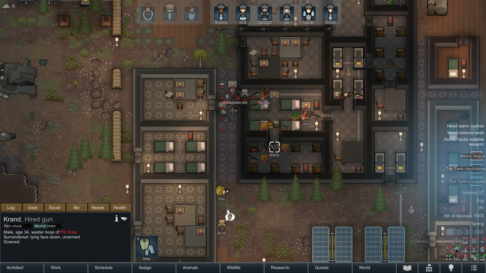
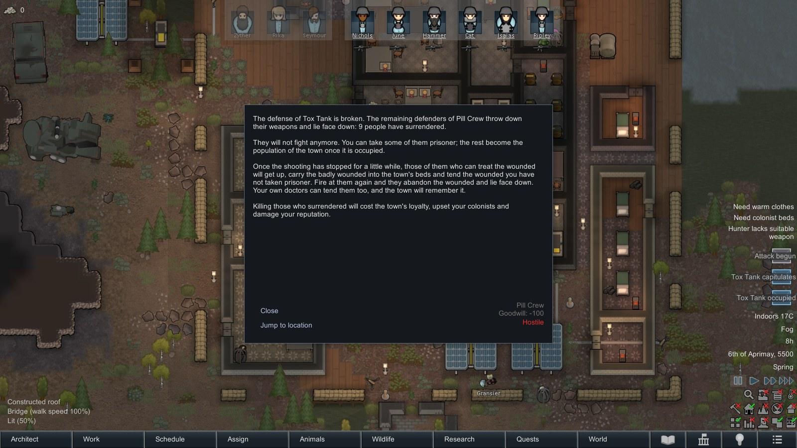
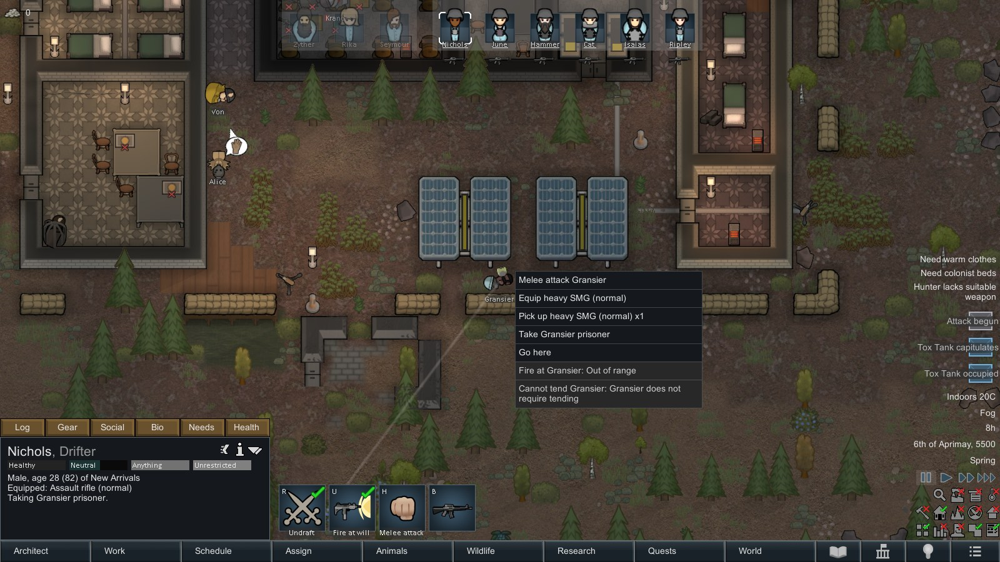
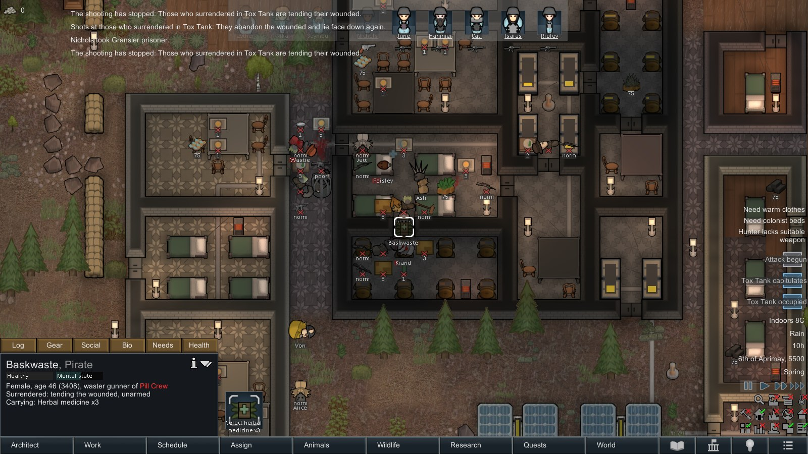
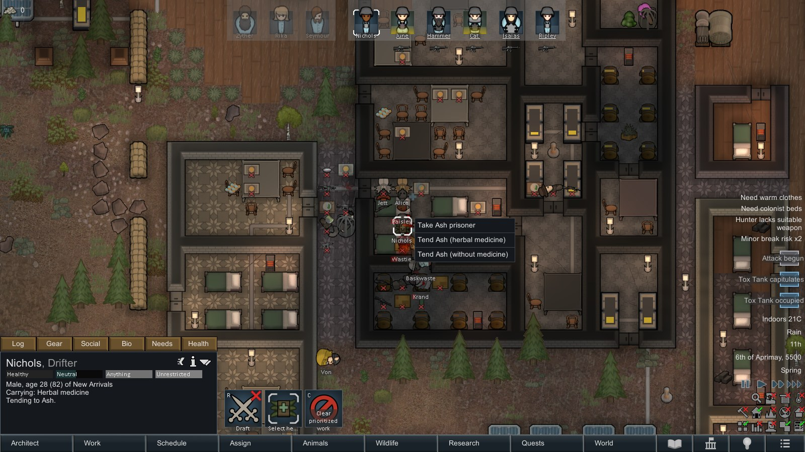
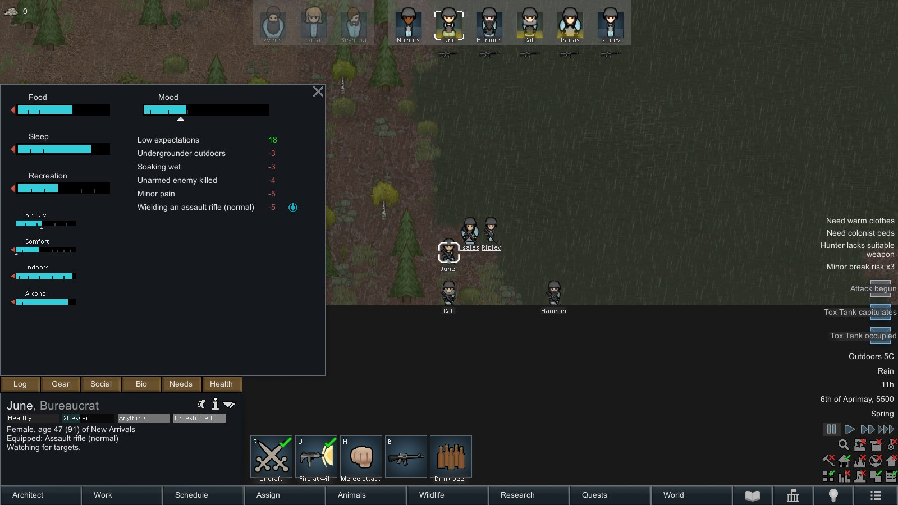
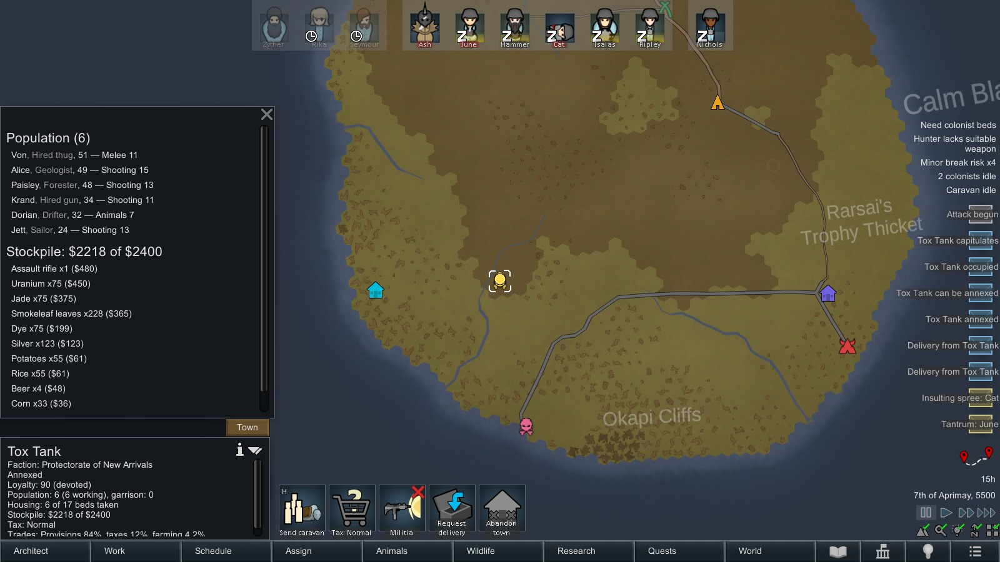
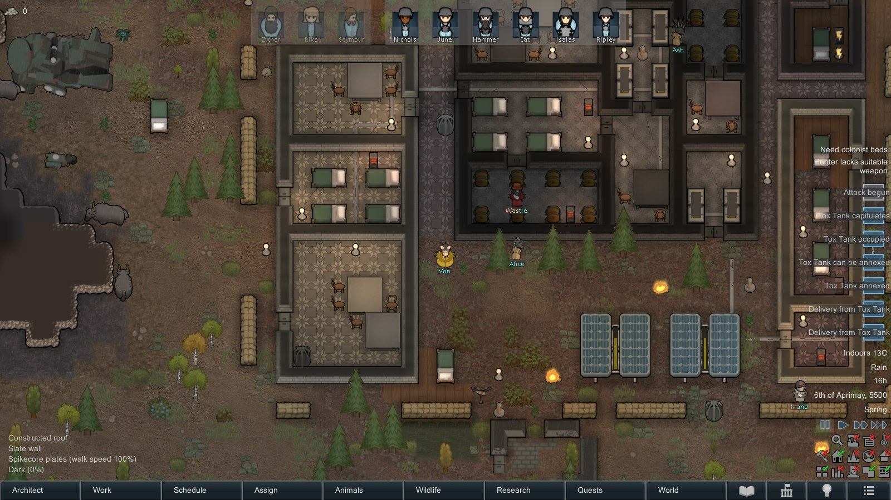

# Occupation & Annexation (RimWorld 1.5)

Enemy settlements no longer have to be wiped out. Break their defense and the survivors
surrender; occupy the town, win its loyalty, annex it, collect its taxes and visit it.

## Screenshots

| | |
|---|---|
|  |  |
|  |  |
|  |  |
|  |  |

More in [Media/Screenshots](Media/Screenshots). They are taken by the autotest itself
(`-oa_screenshots=<folder>`, see below).

## Gameplay

1. **Capitulation.** While you assault a hostile faction settlement, the defenders' morale
   is tracked: lost fighters, destroyed turrets, a fallen commander, suppression
   (Combat Extended) and being outnumbered. When it breaks, every survivor drops weapons
   and ammo and lies face down. Surrendered pawns are no threat: colonists and turrets
   ignore them. Right-click one to **take them prisoner** on the spot. Settlement
   defenders no longer panic-flee off the map (configurable).
   Once no one has fired at them for 15–40 seconds (each medic waits a different time),
   surrendered pawns who can doctor get up, **carry the downed into the town's beds** and
   **tend their wounded** who weren't taken prisoner: bleeding first, then carrying, then
   the rest. They use only the medicine they carry and may pass the town's doors, then
   lie down again. Fire at them or near them, or hurt one of them, and every medic drops
   whoever they carry, lies face down and the wait starts over. Someone a colonist is
   coming for (to take prisoner or to tend) stays down and waits.
   - **Your doctors can tend them too**: right-click someone who surrendered, *Tend*
     (with the cheapest medicine at hand, or without). The town remembers it: +1.5
     loyalty per treatment, up to +15, when you leave.
   - **Consequences.** Killing someone who surrendered upsets the colonists who see it,
     according to their ideoligion's view of executions (without Ideology: by traits;
     psychopaths don't care, bloodlust approves). Factions at peace with you lose
     goodwill (configurable). Leave without killing anyone who surrendered and the
     colonists who took part get a good memory, *spared the defeated*.
2. **Occupation.** Instead of becoming ruins, the settlement becomes a town of your
   **Protectorate**, a single permanently allied faction created on first use. Its
   buildings and turrets switch sides. When your people leave, the survivors stay as the
   town's population, and everything left lying around goes into its stockpile.
3. **Loyalty.** An occupied town starts resentful. Loyalty grows every day, faster with a
   **garrison** (colonists stationed there from a caravan), **low taxes** and **gifts**.
   Killing people who surrendered or locals, and taking prisoners, costs loyalty.
4. **Annexation.** At the configured loyalty and minimum days, press **Annex**.
   Annexed towns work at full strength and their loyalty settles at a content level.
5. **Economy.** Towns produce goods every day, depending on what stands in them:
   fields → crops, kitchens → provisions, smithies → steel and components, and so on.
   The mix is worked out again every time you leave the town map, so workshops and
   fields you build (or lose) during a visit change what the town produces.
   Taxes always bring silver. Output depends on working adults, loyalty, tax level, and
   occupied vs. annexed. The stockpile has a limit per inhabitant. Profiles are XML
   (`Defs/Economy/OA_ProductionProfiles.xml`) and can be extended by other mods.
6. **Collecting.**
   - A caravan at the town: *Take from stockpile* / *Give gifts*.
   - *Request delivery*: townsfolk bring the chosen goods to your colony with pack
     animals, or by drop pod for industrial+ towns.
   - Visiting the town: the stockpile lies in its warehouse.
7. **Visits.** *Visit / Enter town* regenerates the map from a **snapshot** of the town as
   you left it: terrain, floors, roofs, every building with its damage, and crops. The
   locals follow a daily routine:
   - working at benches, tending barrels, generators and fires;
   - farming, hauling in the warehouse;
   - **repairing battle damage** (this is real and persists) and cleaning;
   - guards patrolling, socialising in the evening, sleeping in their beds at night.

   Needs are frozen while they live on schedule.
8. **Population.**
   - **Housing** is the number of beds in the town as you last left it.
   - **Newcomers**: towns with loyalty 50+ slowly gain people until every bed is taken
     (faster when annexed). Build beds during a visit to let a town grow.
   - **Volunteers**: an annexed town with loyalty 60+ lets a townsperson join your colony
     and leave with your caravan (*Recruit a volunteer*): -8 loyalty, one every 5 days.
   - **Militia** (town gizmo, loyalty 40+): as many adults as there are weapons in the
     stockpile train to defend the town. It costs 10% of production and disbands below
     loyalty 25. In an abstract retake fight it adds to the defense (and may lose
     someone); with you on site, the militia takes the weapons lying in town and fights
     alongside you. Townsfolk hand their weapons back to the stockpile when you leave.
9. **Events.** Disloyal towns may **rise up**; a garrison can put the uprising down. Former
   owners may try to **retake** the town: you get two days of warning. With you on site, it
   is a real raid on the town map; otherwise it is resolved from garrison, loyalty and
   militia. A lost town becomes a hostile settlement again.

## Compatibility

- **Harmony** is required.
- **Combat Extended** and **CAI 5000** are optional. They are detected at runtime, with no
  hard references:
  - CE suppression lowers defender morale;
  - surrendered pawns ignore suppression and don't re-arm;
  - CAI's combat reasoning skips surrendered pawns.
- The visit map generator does not inherit `MapCommonBase`, so mods that add scatter steps
  there (e.g. Real Ruins) do not touch towns.

## Ideas for later

Not implemented yet; roughly from most to least promising.

- **Demand surrender.** A caravan next to a hostile settlement, or a button during an
  assault, demands capitulation. The chance depends on the defenders' morale (already
  tracked), the strength of your force and the negotiator's Social skill. A refusal
  briefly raises their morale. A way to take a town without a fight.
- **Raiders capitulate too.** The same morale system on your own map: when a raid breaks,
  part of it surrenders and lies down instead of fleeing. More prisoners, fewer
  runaways. Needs careful balancing, behind a setting.
- **Governing a town.** A governor (a colonist or a local) whose Social and Intellectual
  skills affect loyalty and output. Edicts with trade-offs between loyalty, production and
  the risk of an uprising: curfew, festivals, rationing, conscription.
- **An underground in disloyal towns.** A resistance cell sabotages production; during a
  visit you can find and arrest its ringleaders.
- **Requests from townsfolk during visits.** Fix the generator, drive off animals nearby,
  find a thief: loyalty for help.
- **Risky deliveries.** Caravans with goods can be ambushed on the way; the garrison can
  send an escort.
- **Regional influence.** Several towns in one region make weak neighbouring factions
  offer tribute or join the protectorate peacefully.
- **Integrations.**
  - Hospitality: townsfolk visit the colony as guests and can stay.
  - Vehicle Framework: industrial towns deliver by truck.
  - Royalty: the Empire grants honor for pacified towns.

## Development

```
Source/OccupationAnnexation/OccupationAnnexation.csproj   # net472, Krafs.Rimworld.Ref 1.5.4409, Lib.Harmony 2.3.3
dotnet build -c Release                                  # outputs to 1.5/Assemblies
```

The mod folder is linked into the game with a directory junction:
`RimWorld\Mods\OccupationAnnexation -> D:\Development\Occupation & Annexation`.

The game locks the DLL while running; close it before rebuilding.

### Publishing to the Steam Workshop

RimWorld uploads the whole mod folder, including `.git` and `Source`, so upload a clean
copy instead. `Tools\Build-Release.ps1` builds the DLL and copies only what the game loads
(`About`, `1.5`, `Defs`, `Languages`, `Patches`, `LoadFolders.xml`) to
`Release\OccupationAnnexation`, which git ignores.

1. Close RimWorld and run `.\Tools\Build-Release.ps1 -LinkForUpload`. It points the game's
   `Mods\OccupationAnnexation` junction at the release copy. Pass `-GameModsDir` if RimWorld
   is installed elsewhere.
2. Start RimWorld with Dev mode on. Open *Mods*, right-click *Occupation & Annexation* and
   choose *Upload to Steam Workshop* (*Update on Steam Workshop* later).
3. On the first upload, Steam takes the description from `About\About.xml`. After that, edit
   the page on Steam: paste `Workshop\Description.en.bbcode`, add the Ukrainian description
   from `Workshop\Description.uk.bbcode`, add images from `Media\Screenshots` and set the
   visibility.
4. Close the game and run `.\Tools\Build-Release.ps1 -LinkForDevelopment`. It points the
   junction back at the repository and copies `About\PublishedFileId.txt`, written by the
   game on the first upload, into the repository. Commit that file; later uploads then
   update the same Workshop item.

Bump `<modVersion>` in `About\About.xml` and `<Version>` in the `.csproj` for each release.

### Dev-mode tools

- **Debug actions**, category *Occupation & Annexation*: *Force capitulation*,
  *Log siege morale*, *Log hostile threats* (what keeps "Reform caravan" disabled),
  *Log surrendered medics* (the ceasefire and when each surrendered pawn may tend).
- **Town gizmos** with *Show dev gizmos* on: loyalty ±20, pass a day, produce 10 days,
  trigger uprising, trigger retake attempt.

### End-to-end self test

```
RimWorldWin64.exe -quicktest -oa_autotest -oa_autotest_quit -oa_report=C:\path\report.txt ^
    -savedatafolder=C:\path\testdata -logFile C:\path\rw.log
```

Use a separate `-savedatafolder` whose `Config/ModsConfig.xml` activates Harmony, the DLCs,
optionally CE/CAI, and this mod. Set `autosaveIntervalDays` > 0 in its `Prefs.xml`.

The test covers:
- the assault, capitulation, taking a prisoner and occupation;
- surrendered medics: the 15–40 s ceasefire, carrying the downed into beds, tending,
  real shots near them and far away, and hurting one of them;
- your doctor tending someone who surrendered; killing one of them (colonists'
  thoughts by their views, goodwill), sparing them;
- leaving the map (loyalty from kills, prisoners and tending), and a save/load round-trip;
- annexing, production, caravan and drop-pod deliveries;
- opening every window, tab and gizmo;
- a full-day visit with checks on snapshot restoration and town jobs; building
  workshops and beds, arming the militia;
- a second leave: new production mix, more housing, weapons back in the stockpile;
- newcomers, volunteers, militia strength and disbanding;
- retake and uprising.

It writes the PASS/FAIL report and counts every error logged during the run.

With `-oa_screenshots=C:\path\shots` it also takes the Workshop screenshots. The run
pauses at each scene, frames it, and captures it without the dev tools. In this mode
the assault starts in the morning and the squad carries rifles, armor and food. Use a
windowed 1600×900 test profile with the learning helper off (`adaptiveTrainingEnabled`
False). Convert the PNGs to JPG for `Media/Screenshots`.

### Note from Devloner
This mod was created using a LLM, so please keep that in mind if you use it.

## License

[MIT](LICENSE) © 2026 Devloner.
